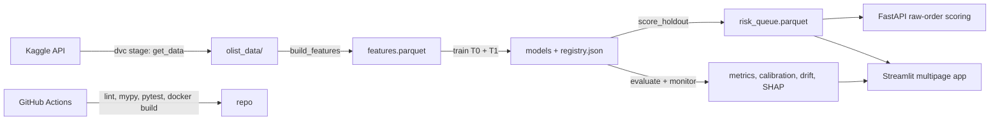

# Portfolio-Grade Overhaul: Pipelines, Workflows, and UI/UX Redesign

## Guiding decisions (confirmed)

- Frontend: polished **Streamlit multipage** app, deployed as a live demo.
- MLOps backbone: **DVC** pipeline DAG with data/artifacts out of git.
- Quality of implementation is the priority — every phase ends with CI green, typed, tested code.

## Target architecture

---

## Phase 1 — Engineering foundation (do first; everything depends on it)

**Packaging.** Add `pyproject.toml` (hatchling or setuptools, `requires-python >= 3.11`), make `cx_risk` and `cx_risk_api` installable from `src/`, and delete every `sys.path.insert` hack in `tests/`, `app/streamlit_app.py`, and all scripts. Use `uv` for lockfile + fast installs (`uv.lock` committed). Pin Python 3.11 everywhere (README currently says 3.9 conda; Dockerfile says 3.11 — resolve to 3.11).

**Tooling.** `ruff` (lint + format), `mypy` on `src/` (strict-ish: `disallow_untyped_defs` on the package), `pre-commit` with both plus basic hygiene hooks. All config in `pyproject.toml`.

**Tests restructure.** Split `tests/` into `tests/unit/` (synthetic fixtures only, runs anywhere — model the existing `test_historical_features_exclude_current_and_future_targets` style) and `tests/integration/` (needs `olist_data/`, marked and auto-skipped when absent). Add a small `conftest.py` fixture factory that builds a tiny synthetic relational Olist dataset (orders/items/payments/reviews) so feature-engineering and split logic get real unit coverage.

**CI.** `.github/workflows/ci.yml`: ruff → mypy → unit pytest (with coverage) → docker build, on push/PR. Badges in README. Optional second workflow that runs the DVC pipeline on a schedule/manual dispatch later.

**Repo scrub.** Remove `docs/resume_bullets.md`, `ways-to-expand.md`, `docs/expansion_plan.md` (fold the surviving content into a short `ROADMAP.md`), move `olist_cx_risk.ipynb` to `notebooks/`, drop all `itcs-3156`/`ML_FINAL_PROJECT` references. Deduplicate constants: `HISTORICAL_FEATURE_COLUMNS` (`src/cx_risk/historical.py` vs `src/cx_risk/preprocessing.py`), `DEFAULT_QUEUE_MODEL` (`scoring.py` vs app), app-local path constants → import from `cx_risk.config`. Delete the dead sklearn `OneHotEncoder` compat shim in `preprocessing.py`.

## Phase 2 — Pipeline and workflows (CLI + DVC)

**One CLI replaces 9 scripts.** New `src/cx_risk/cli.py` (Typer) with console entry point `cx-risk`:
`cx-risk data download` (Kaggle API), `cx-risk features build`, `cx-risk train`, `cx-risk score`, `cx-risk evaluate`, `cx-risk monitor`, `cx-risk experiment`. Scripts directory is deleted; Makefile becomes thin aliases over `uv run cx-risk ...` and `dvc repro`.

**Config.** Replace bare constants with `pydantic-settings` (`cx_risk/settings.py`): paths, split fraction, queue fraction, risk-band thresholds, all env-overridable; hyperparameters live in `params.yaml` (read by DVC stages).

**DVC DAG.** `dvc.yaml` stages: `get_data → build_features → train → score_queue → evaluate → monitor`, with `params.yaml` dependencies so metric/feature changes invalidate correctly. `dvc metrics` for headline numbers (PR-AUC, lift@10%), `dvc plots` for operating curves. Remove `outputs/tables/*.csv` from git; track via DVC with a public remote (start with a free option, e.g. a Google Drive or S3-compatible remote) so `dvc pull` reproduces the dashboard state. Intermediate data switches CSV → parquet.

**Model registry hardening.** `model_registry.json` gains git SHA, data hash (from DVC), feature-set name, decision-time tag, and metric snapshot per model.

## Phase 3 — Modeling: fix leakage, two decision times, stronger models

**Fix the in-repo leakage.** `expensive_order_flag` (full-dataset 0.75 quantile) and `customer_city_freq` (full-dataset value_counts) in `src/cx_risk/features.py` leak test-window statistics. Move both into custom sklearn transformers (`QuantileFlagTransformer`, `FrequencyEncoder`) fit inside the pipeline on train only. Add a regression unit test proving train-only fitting. Write the find-and-fix up in the README — it is the best story in the repo.

**Two decision-time models.** Formalize feature availability by decision point:

- **T0 (at purchase)** — current leakage-safe feature set; this is the existing model.
- **T1 (at delivery, pre-review)** — adds actual delivery delay, carrier handoff lag, lateness vs estimate (legitimately known once delivered, before the review exists). Expect a large AUC jump; this reframes the modest T0 score as a property of the decision point, not the pipeline.

Implement as named feature sets in `preprocessing.py` with per-set forbidden-column guards; both trained/scored/evaluated through the same DVC stages.

**Stronger models + honest metrics.** Add LightGBM with Optuna tuning (small, time-budgeted study; tracked in `params.yaml`/dvc), time-aware cross-fit target encoding as an experiment branch, isotonic/Platt calibration on the deployed model, and bootstrap CIs on PR-AUC / precision@k / lift@10%. Lead all reporting with PR-AUC and lift@k, not ROC-AUC.

**SHAP.** TreeExplainer global beeswarm + per-order contributions persisted as artifacts (`shap_summary.parquet`, per-queue-row top contributors) consumed by the dashboard and returned by the API. Keep the rule-based reason codes as the operational layer alongside.

## Phase 4 — API and deployment hardening

**Raw-order scoring.** The API currently requires pre-engineered features (`src/cx_risk_api/service.py`) — nothing real can call it. Add a `POST /score-order` endpoint that accepts a raw order payload (items, payments, timestamps, customer state), runs the same feature builders at inference, and resolves historical seller/category rates from a precomputed lookup table snapshotted at train time (stored in the existing SQLite/DuckDB). This closes the train/serve loop. Keep the engineered-features endpoint for batch parity, return SHAP top contributors in responses.

**Container.** Multi-stage `Dockerfile` (uv builder → slim runtime), `.dockerignore`, non-root user, `HEALTHCHECK`, no `COPY . .`. Compose file mounts only artifacts. API gets structured logging and a `/metrics`-style info endpoint with model version metadata.

## Phase 5 — Website / UI-UX redesign (dedicated plan)

**Information architecture.** Collapse the current 11 sidebar views (793-line monolith with `subprocess` buttons) into 6 persona-oriented pages using Streamlit's modern `st.navigation`/`st.Page` API:

1. **Home** — hero narrative: problem, decision-time diagram, 4 KPI cards (lift@10%, recall@10%, T1 AUC, queue size), one headline operating-curve chart. Designed for the 30-second recruiter skim.
2. **Risk Queue (Operations)** — the product page: filterable ranked queue, risk-band chips, order drill-down with SHAP waterfall + reason codes + recommended action, CSV export. No training buttons — read-only artifact consumption.
3. **Model Performance** — T0 vs T1 comparison, validation tables with bootstrap CI error bars, calibration reliability plot, threshold/queue-size operating curves.
4. **Explainability** — global SHAP beeswarm, permutation importance, feature-family breakdown, honest "what the model can't see" section.
5. **Business Value** — interactive scenario simulator (cost/save-rate sliders → ROI, break-even), sensitivity heatmap.
6. **Monitoring & Methodology** — rolling backtests, drift report, leakage-prevention writeup (including the found-and-fixed leak), model card link.

**Structure.** `app/streamlit_app.py` becomes a thin entry; pages in `app/views/`, shared `app/components/` (artifact guard, KPI row, chart factory, queue table) and `app/charts.py`. All data access through cached loaders importing `cx_risk.config` — no duplicated paths, no `subprocess`.

**Visual design.**

- `.streamlit/config.toml` theme: deliberate palette (e.g. deep navy primary, warm accent for risk bands: low→green / medium→amber / high→orange / critical→red used consistently everywhere), Inter/Source Sans font, wide layout.
- Replace every `st.line_chart`/`st.table` with **Plotly**: hover tooltips, shaded CI bands, annotated "current operating point" markers, consistent axis formatting (% formatting, thousands separators) via one chart-factory module.
- Consistent component vocabulary: KPI metric rows with deltas, colored risk-band badges, caption-level honesty notes ("prioritization, not causal impact") styled as a reusable callout.
- Empty states: if artifacts are missing, show one clean instruction card (`dvc pull` / `make demo`), not per-file warnings.

**Deployment + README payoff.** Deploy to Streamlit Community Cloud; app start runs `dvc pull` (public remote) for artifacts. README gets: live-demo link, animated GIF walkthrough, badges, mermaid architecture diagram, results-with-CI table, and the leakage case study. Capture screenshots into `docs/screenshots/`.

---

## Task tracker

### Phase 1 — Engineering foundation

- [ ] `pyproject.toml` + `uv`, installable `src/` packages, delete all `sys.path` hacks, pin Python 3.11
- [ ] ruff + mypy + pre-commit; GitHub Actions CI (lint, type, unit tests, docker build) with badges
- [ ] Split tests into unit (synthetic fixtures via conftest factory) and integration (skipped without data)
- [ ] Remove internal/class-project docs, dedupe constants, move notebook to `notebooks/`, add `ROADMAP.md`

### Phase 2 — Pipeline and workflows

- [ ] Typer CLI (`cx-risk`) replacing `scripts/`, pydantic-settings config, `params.yaml`
- [ ] `dvc.yaml` DAG (data → features → train → score → evaluate → monitor), metrics/plots, remote, untrack outputs CSVs from git

### Phase 3 — Modeling

- [ ] Move quantile flag + city frequency into train-only sklearn transformers with regression tests
- [ ] T0 (purchase) and T1 (delivery) decision-time feature sets, trained and evaluated through shared stages
- [ ] LightGBM + Optuna, calibration, bootstrap CIs, PR-AUC/lift@k-first reporting
- [ ] SHAP global + per-order artifacts for dashboard and API

### Phase 4 — API and deployment

- [ ] Raw-order `POST /score-order` endpoint with inference-time feature building + historical lookup store
- [ ] Multi-stage Dockerfile, `.dockerignore`, non-root, healthcheck, versioned registry metadata

### Phase 5 — Website / UI-UX

- [ ] Restructure app into `st.navigation` views/ + components/ + chart factory, 6 persona-oriented pages, remove subprocess
- [ ] Theme config, Plotly charts with CI bands, risk-band color system, empty states
- [ ] Deploy to Streamlit Cloud (`dvc pull` on start), README rewrite with demo link, GIF, diagram, leakage case study

---

## Sequencing and verification

Phases land in order 1→5; each phase is merge-ready alone (CI green, `uv run pytest` passing, `dvc repro` clean from Phase 2 onward). Phase 3 is the largest; T0/T1 split lands before tuning. The UI redesign (Phase 5) starts only after queue/SHAP artifacts exist so pages are built against final schemas.
